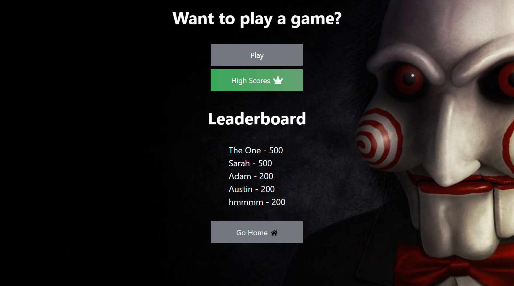
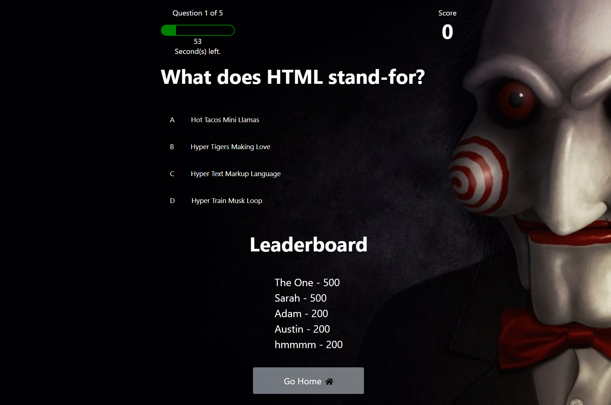
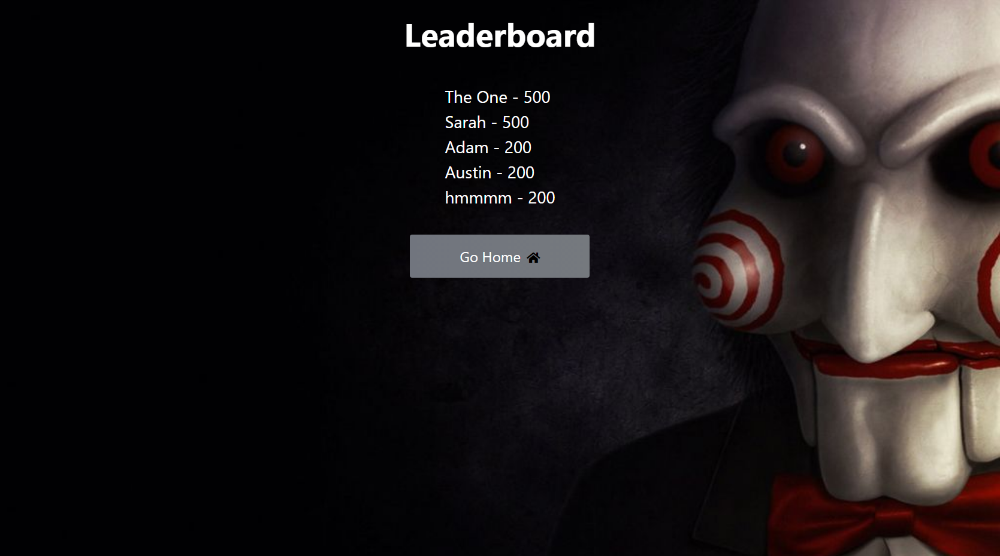

# Adam's Coding Quiz Game

## Instructions:

CLICK HERE TO PLAY THE GAME!  
https://kovaceva11.github.io/Coding-Quiz-Game/

When you first visit the Game Page you are greeted with a Play Button and High Scores Leaderboard Button.

Once you click Play, the game and the countdown timer will begin. The player is tasked with answering 5 multiple-choice questions about Javascript. If you run out of time the game will end. If you answer incorrectly, you will lose 5 seconds off the timer. 

Good luck, and have FUN!

# Start Page

# Game Page

# End Page

# Credits

W3 Schools HTML & CSS Tutorials [https://www.w3schools.com/](www.w3schools.com)

MDN Web Docs [https://developer.mozilla.org/en-US/](Developer.Mozilla.Org)

Font Awesome [https://fontawesome.com/](www.fontawesome.com)
> **Icon Package**: Free to use, no license required icon css styling package. Reference [./assets/css/all.css]

Sarah Labrot: [https://github.com/SarahLabrotLientz](www.github.com)
>Thanks for the emotional support and debugging fun.

Alex Kang: [https://github.com/mkang987/](www.github.com)
>Assistance with the timer

Brian Design: [https://www.youtube.com/watch?v=f4fB9Xg2JEY](www.youtube.com)
>For the great tutorial

# The Code
Click here to view the Github Repo for this Javascript Game! 
[https://github.com/Kovaceva11/Coding-Quiz-Game](www.github.com)
